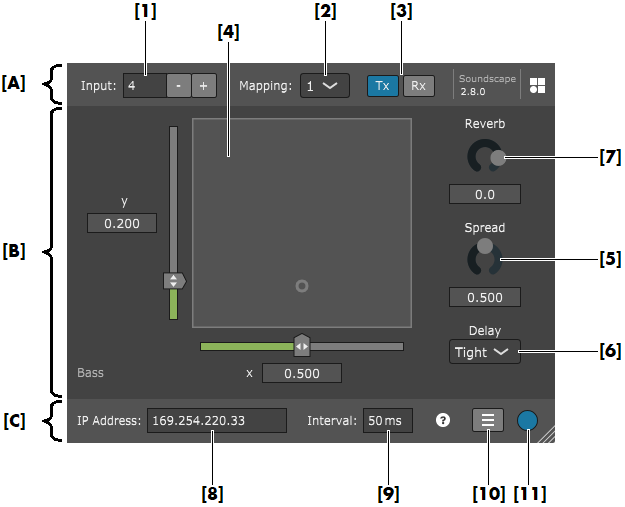
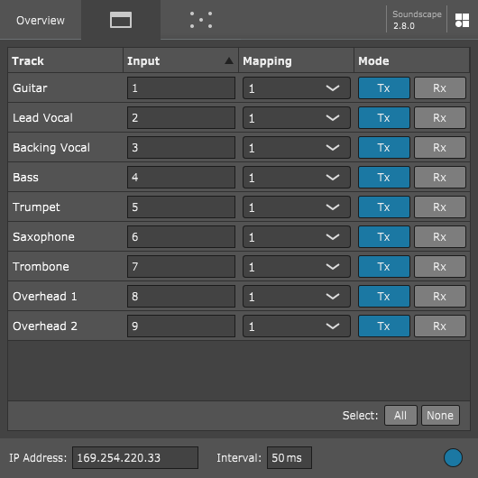
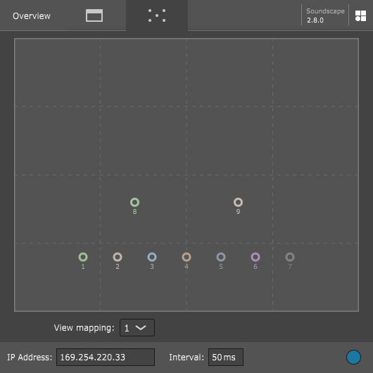

# d&b Soundscape Plug-in

Copyright (C) 2017-2020, d&b audiotechnik GmbH & Co. KG

By downloading software from this site, you agree to the terms and conditions described in the [End-User License Agreement](EULA.md). If you do not agree with such terms and conditions do not download the software.

## Latest binaries can be downloaded here: [LATEST RELEASE](../../releases/latest)

---

## What is the d&b Soundscape Plug-in?

The d&b Soundscape Plug-in enables a Digital Audio Workstation (DAW), Avid VENUE S6L console, or any other Plug-in host to control the basic En-Scene and En-Space parameters of any desired sound object on the DS100 platform using the OSC protocol. It is designed to work with d&b Soundscape and the d&b DS100.

For more information about the d&b Soundscape system, go to www.dbaudio.com and www.dbsoundscape.com.

## Features 

- Allows automated Soundscape parameters of any desired sound object to be transmitted in real time from a DAW to the DS100 via OSC.
- Allows a DAW to record basic Soundscape parameters of any sound object in the DS100 as automation envelopes or as snapshots.
- The d&b Soundscape Plug-in does not perform any audio processing or affect the DAW audio output in any way.

### En-Scene object parameters
- X/Y position (relative to a selected coordinate mapping) 
- Spread
- Delay mode 

### En-Space object parameters
- Reverb send level 

## Requirements
- Digital Audio Workstation (DAW), Avid VENUE S6L console, or any other host which supports one of the provided Plug-in formats. 
- d&b DS100 Signal Engine with active En-Scene and/or En-Space license. 
- Both the DS100 and the Plug-in host must be connected to the same Ethernet network. 

## Available Plug-in formats
- VST3 (Win64, Win32, and MacOS)
- AAX (Win64 and MacOS)
- AU (MacOS)

---

# Quick start guide

* [Getting started](#getting-started)
* [Connecting with the d&b DS100 Signal Engine](#connecting-with-ds100)
* [Plug-in configuration](#plugin-configuration)
* [Troubleshooting](#troubleshooting)

<a name="getting-started" />

## Getting started

### 1. Install the Plug-in

* On Windows systems, please unpack and copy the d&b Soundscape Plug-in to the appropriate location depending on your DAW and Plug-in format. Common locations are as follows:  
  * **AAX:** C:\Program Files\Common Files\Avid\Audio\Plug-Ins
  * **VST3:** C:\Program Files\Common Files\VST3
  
* On MacOS systems, simply double-clicking the **pkg** file will install the Plug-in into the correct location. The default installation paths are as follows:  
  * **VST3:** /Library/Audio/Plug-Ins/VST3
  * **AU:** /Library/Audio/Plug-Ins/Components
  * **AAX:** /Library/Application Support/Avid/Audio/Plug-Ins
  
* On Avid VENUE S6L consoles, please install the Plug-in as follows:
  1. Unpack the d&b Soundscape **AAX** Plug-in and copy the "SoundscapePlugin.aaxplugin" file into an USB drive, under a folder named "AAX Plug-Ins".
  2. Set the Avid VENUE S6L console to configuration mode and insert the USB drive.
  3. On the VENUE user interface, go to the "Options" page and select the "Plug-Ins" tab.
  4. Under "Plug-ins to install" choose your USB drive from the available devices, select the d&b Soundscape Plug-in, and click on "Install".  
    For more detailed info please refer to your Avid VENUE S6L documentation.

### 2. Insert the Plug-in

* Open your DAW and insert a new track or choose an existing track.
* Add the d&b En-Scene Plug-in to the effect chain of the track.  
  You may need to let your DAW re-scan its Plug-in folders.

### 3. Use the Plug-in

* Open the Plug-in's interface and enter the desired input number in the **«Input»** field.  
  This is the matrix input number that will be used on the DS100 for the corresponding sound object of this track.
* Add envelope tracks for the automation of the desired Plug-in parameters on your DAW.
* Using these envelopes, you can now define detailed movements for each individual sound object at any point in your DAW's timeline.  
  You can do this by drawing envelope points by hand or by recording your movements with the Plug-in's graphical interface.
 
---

<a name="connecting-with-ds100" />

## Connecting with the d&b DS100 Signal Engine

1. Ensure that the DS100 is connected to the same Ethernet network as your PC and their IP addresses and subnet masks are compatible.  
  **Note:** On Avid VENUE S6L consoles, use the **«ECx»** port on the back panel. On the VENUE user interface, go to the "Options" page, select the "Interaction" tab, and configure the "Ethernet control" settings accordingly.
2. Enter the IP address of your DS100 into the Plug-in's **«IP address»** field.  
  The **«Online»** indicator will turn blue to indicate that the connection has been established successfully.  
  **Note:** The IP address of the DS100 can be obtained from the **«Info»** tab of the **«Device»** view in R1 V3.
3. Using R1 V3, ensure the desired DS100 Matrix inputs are set to **«En-Scene»**, and also configure the coordinate mapping settings for external control. Please also refer to **TI 501** featuring d&b Soundscape and the R1 Help for more information.

### OSC Send Mode
1. In the DAW, set the track's automation mode to **«Read»** so that the Plug-in parameters are determined by the points drawn in their automation envelopes.
2. Set the Plug-in to **«Tx»**.
3. Set the DAW to Play.  
  The parameter values in your envelopes will be transmitted to the DS100 and the corresponding sound object will be positioned accordingly in real time.

### OSC Receive Mode
1. In the DAW, set the track's automation mode to **«Write»** or **«Touch»**.  
  In this way, the automation envelopes for the desired parameters will be drawn as determined by the Plug-in.
2. Set the Plug-in to **«Rx»**.
3. Ensure the envelope tracks of the desired parameters are armed for recording.
4. Set the DAW to Play.  
  The position of the corresponding sound object will be requested from the DS100 and will then be written to the automation envelopes accordingly in real time.

---

<a name="plugin-configuration" />

## Plug-in configuration

The d&b Soundscape Plug-in user interface is divided in three different areas.

### [A] Plug-in configuration parameters

Configuration settings relevant for the DS100 project setup and for the OSC communication mode of the individual Plug-in instance.

* **[1]** DS100 Matrix input number, corresponding to the sound object to be positioned.

* **[2]** Selector for the DS100 Coordinate mapping setting.  
  Allows you to choose between 4 possible mappings, which can be configured using R1 V3 (please refer to TI 501 and the R1 Help for more information).

* **[3]** Selector for the Plug-in's OSC communication mode.
  * When **«Tx»** mode is enabled, this Plug-in transmits its parameter values from your DAW to the DS100.
  * While **«Rx»** mode is enabled, the Plug-in requests the parameter values from this sound object in the DS100 and passes them on to the DAW.
  * Both **«Tx»** and **«Rx»** can be enabled, resulting in bi-directional communication.
  * To bypass the Plug-in, both **«Tx»** and **«Rx»** can be turned off, thus disabling OSC communication for the individual Plug-in instance.

### [B] Soundscape parameters

The user interface to control the d&b Soundscape parameters of an individual sound object. These parameters can be recorded and automated in different ways depending on the functionality of the hosting DAW.

* En-Scene
  * **[4]** x/y slider surface used to set or display the position of the assigned sound object.
  * **[5]** Rotary knob used to set or display the Spread parameter of the desired sound object.
  * **[6]** Drop-down menu used to set or display the Delay Mode of the desired sound object.
* En-Space
  * **[7]** Rotary knob used to set or display the En-Space Reverb send level parameter of the desired sound object or matrix input.

### [C] Global configuration parameters

The settings at the bottom of the Plug-in's interface are global and are shared among all Plug-in instances in your DAW project. 
  
* **[8]** IP address of the DS100 Signal Engine.  
  The IP address of the DS100 can be obtained from the **«Info»** tab of the **«Device»** view in R1 V3.

* **[9]** Transmission interval, in milliseconds.  
  Determines how frequently OSC messages are interchanged between the Plug-in and the DS100.  
  A smaller interval will result in more fluent movements, but also in more network and processing load. The default and recommended setting is 50 milliseconds.

* **[10] «Overview»** window button.
  Clicking on this button will pop up the **«Overview»**, an additional window containing a Plug-in configuration table and the multi-object surface.

  * **Plug-in configuration table.**  
    This is a list of all Plug-In instances in the project and their configuration parameters, including the name of the track where each Plug-in is inserted, the Matrix input number, the selected coordinate mapping, and the OSC communication mode.
	
	
	
  * **Multi-object surface.**  
    This is an x/y slider similar to the one on the main Plug-in graphical interface, but displaying the positions of all Plug-in instances in the project.  
    Clicking and dragging individual sound objects on this surface is also possible.  
	**Note:** Only the sound objects assigned to the selected coordinate mapping will be displayed.

	
	
* **[11] «Online»** indicator.  
  Turns blue when an OSC connection between the Plug-in and the DS100 has been successfully established.

---

<a name="troubleshooting" />

## Troubleshooting

#### The Soundscape Plug-in is not recognized by my DAW, or gets blacklisted by my DAW.

* Ensure that you have let your DAW re-scan its Plug-in folders. You may need to restart your DAW after installing the Plug-in.
* To work under Windows 10, the Soundscape Plug-in may require the Visual C++ Redistributable Packages for Visual Studio 2017. These packages are included in the latest Windows Updates, and are also included when installing d&b's R1V3 or ArrayCalc.  

#### My Plug-in's «Rx» mode is enabled, and I am moving a sound object in R1, but am still unable to record an automation envelope with my DAW.

* Ensure that the DS100's IP address has been entered correctly in the Plug-in, and that the **«Online»** indicator is blue.  
  The IP address of the DS100 can be obtained from the **«Info»** tab of the **«Device»** view in R1 V3.
* Check that the envelope automation mode on your DAW is set to **«Write»**, **«Touch»**, or **«Latch»**. When set to **«Read»**, the envelope's current values may have priority over whatever the Plug-in is receiving from the DS100 via OSC.

#### Reaper: Automation envelopes can only be recorded when the Plug-in's GUI window is open.

* By default, when the plugin's window is closed, parameter automation envelopes will not get written to even though the parameter values may be changing. 
* To fix this, go into Reaper's Preferences > VST > VST compatibility > Parameter automation notifications, and set it to **«Process all notifications»**.

#### The sound object on the Plug-in's GUI "jitters" or jumps constantly between two positions.

* This may occur when the Plug-in's **«Rx»** mode is enabled, but the track's automation mode in the DAW is set to **«Read»**. If the sound object's position in the DS100 and the position given by the automation envelope conflict with each other, the Plug-in's GUI will attempt to display both conflicting positions at the same time.
* To resolve this, ensure the Plug-in's OSC communication mode and the track's automation mode match your current workflow. Use **«Rx»** mode and **«Write»** automation for recording envelopes; use **«Tx»** mode and **«Read»** automation when playing them back during the show.

### Known Issues

#### Avid S6L: Input and Mapping do not change reliably when loading showfiles or snapshots.

* This can occur when only Input or Mapping have changed, but all other parameters (such as X/Y, Spread, etc.) in the showfile or snapshot being loaded are identical to the current values.
* When storing a showfile or snapshot after having only changed the Input or Mapping, nudge one of the other parameters to ensure that a change is registered when loading it later.
